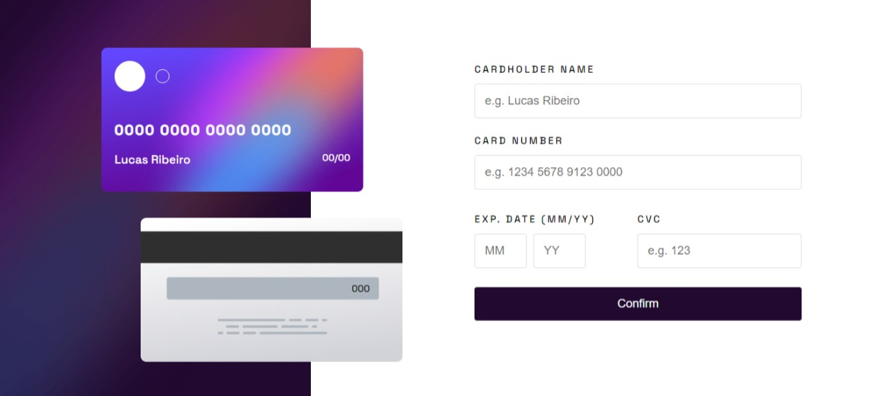

# Frontend Mentor - Interactive card details form solution

This is a solution to the [Interactive card details form challenge on Frontend Mentor](https://www.frontendmentor.io/challenges/interactive-card-details-form-XpS8cKZDWw). Frontend Mentor challenges help you improve your coding skills by building realistic projects.

## Table of contents 🧑‍💻

- [Overview](#overview)
  - [Screenshot](#screenshot)
  - [Links](#links)
- [My process](#my-process)
  - [Built with](#built-with)
  - [What I learned](#what-i-learned)
- [Author](#author)


## Overview 👋

Users can do and see:

- Fill in the form and see the card details update in real-time
- Receive error messages when the form is submitted if:
  - Any input field is empty
  - The card number, expiry date, or CVC fields are in the wrong format
- View the optimal layout depending on their device's screen size
- See hover, active, and focus states for interactive elements on the page

### Screenshot



You can see this one, it's my solution and i liked to make it.👋


### Links ☕

- Solution URL: [https://www.frontendmentor.io/solutions/interactive-card-details-application-g1ZFPNjy9D](https://www.frontendmentor.io/solutions/interactive-card-details-application-g1ZFPNjy9D)
- Repository link: [https://github.com/devlucaspro/interactive-card-details](https://github.com/devlucaspro/interactive-card-details)
- Live Site URL: [https://card-details-devlucas.netlify.app/](https://card-details-devlucas.netlify.app/)

## My process 🔥

### Built with

- Semantic HTML5 markup
- CSS custom properties
- Flexbox
- Responsive web application
- Javascript
- Javascript DOM

### What I learned 📖

I learned more about JS and some methods that i did not know, i learned one attribute html that i did not know also and border gradient in CSS, see below:

```html
<!-- maxlength="" -->
<input type="text" maxlength="6">
```
```css
/* Border-image */
input:focus {
    border: 1px solid transparent;
    -webkit-border-image: linear-gradient(to right, hsl(249, 99%, 64%), hsl(278, 94%, 30%)) 1;
    -o-border-image: linear-gradient(to right, hsl(249, 99%, 64%), hsl(278, 94%, 30%)) 1;
    border-image: linear-gradient(to right, hsl(249, 99%, 64%), hsl(278, 94%, 30%)) 1;
    outline: none;
}
```
```js
// .remove()
let elementos = document.querySelectorAll(".my-elements");
elementos.forEach(function (elemento) {
    elemento.remove();
});

// insertAdjacentElement
btn.insertAdjacentElement('beforebegin', title)
```

## Author 👋

I'm front end software developer and UI Designer, you can see more about me on these links below.

- Portfolio - [Lucas Ribeiro](https://lucasrdev.netlify.app/)
- Frontend Mentor - [@devlucaspro](https://www.frontendmentor.io/profile/devlucaspro)
- My links - [Connect with me](https://devlucaslinks.netlify.app/)
